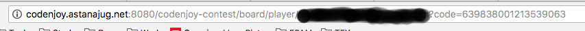

Мы думаем, что каждый из вас в детсве проводил время за сборкой самой длиной змеи, которую только можно собрать. Иногда ностальгия на нас нахлынывает и мы достаем кусочки воспоминаний из нашей памяти о тех сладких моментах. Мы предлагаем вам окунуться в прошлое и решить задачу сборки саомй длиной змеи. Только задача в этот раз будет более сложной - вам необходимо будет написать бота, который будет отдавать команды змейке, для того чтобы съесть кусочек яблока, который позволит увеличить вашу длину, тем самым получая очки. Ваш бот будет получать состояние поля по которому ползет змейка от нашего сервера, размещенного [здесь](http://codenjoy.astanajug.net:8080/codenjoy-contest)player-code.png. Ваш бот может быть реализован с использованием одной из представленных платформ:

* Java
* .Net
* Node.js

# Регистрация игрового бота
Прежде чем приступать к реализации вашего бота необходимо пройти регистрацию вашего бота на сервере. Для этого переходим по адресу http://codenjoy.astanajut.net:8080/codenjoy-contest/register. В открывшейся форме указываем следующие данные:
 * email с которым будет ассоциирован ваш бот
 * пароль
 
 После того как вы завершите регистрацию вам необходимо запомнить (а лучше записать) code, который был присвоем вашему боту. Найти его можно будет в адресной строке, на странице вашего персонального поля, на котором идет игра.

 

 В случае если вы забыли ваш code, вы можете пройти на страницу регистрации указать логин и пароль, которые вы использовали ранее для регистрации. И сервер снова перенаправит вас на ваше персональное игровое поле.

# Правила игры

Итак, собственно в чем суть игры.

Вашему боту необходимо за отведенное время набрать наибольшее количество очков. Достичь этого можно, если змейка, контролируемая вашим ботом, будет употреблять много полезных фруктов, а, именно, яблок, меньше съедать камней и как можно реже умирать. Каждое съеденое яблоко, даёт змейки возможность вырасти на один сегмент, а вашему боту +1 очко. Каждый съеденный камень вашей змейки, уменшьшает количество сегментов на 10. Если при съедании камня, количество сегментов было меньше 10, то ваша змейка погибает. Также змейка погибает, если врежется в себя или стену. Стена на игровом поле расположена по краям, то есть бесконечного игрового поля не существует.

Состояние игрового поля каждую секунду передается вашему боту в виде строки, следующего формата

```
board==☼☼☼☼☼☼☼☼☼☼☼☼☼☼☼☼             ☼☼      ☻      ☼☼            ☺☼☼            ▲☼☼            ║☼☼            ║☼☼            ║☼☼            ╙☼☼             ☼☼             ☼☼             ☼☼             ☼☼             ☼☼☼☼☼☼☼☼☼☼☼☼☼☼☼☼
```

Извлечь информацию из данной строки можно воспользовавшись следующим regexp выражением ```^board=(.*)$```

В течение секунды вашему боту необходимо будет разобрать состояние поля, найти оптимальный путь к яблоку, избежав при этом камней и стен, и предоставить ответ в виде команды-действия для вашей змейки. 

Если в течение секунды сервер не получит от вашего бота команды для задвния напрвления движения змейки, то она продолжит движение по инерции.

## Символы обозначающие состояние ячейки игрового поля

Каждая ячейка игроового поля может быть представлена следующими символами:

* ```' ' ``` (пустая поле) - данная ячейка и змейка может по ней двигаться
* ```'☼'``` - стена, расположена по краям игрового поля
* ```'☻'``` - камень
* ```'☺'``` - яблоко
* ```'▲', '◄', '►', '▼'``` - голова змейки, острый конец которой показывает, куда двигается змейка
* ```'║', '═', '╗', '╝', '╔', '╚'``` - тело змейки
* ```'╙', '╘', '╓', '╕'``` - хвост змейки

## Команды для задания направления движения змейки

Для задания направления движения змейки вы можете использовать следующие команды:

* ```LEFT``` - направить движение змейки налево
* ```RIGHT``` - направить движение змейки направо
* ```UP``` - направить движение змейки наверх
* ```DOWN``` - направить движение змейки вниз


Надеемся, что вам понравится провести время, получая удовольствие от решения нашей задачи.